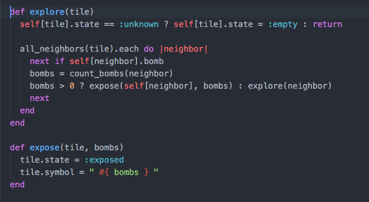
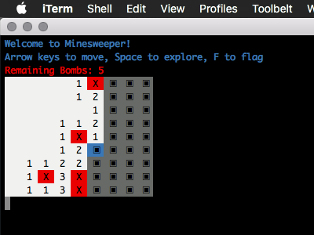

# Minesweeper

This is a command line implementation of the classic Minesweeper game. It is written in Ruby, focusing on encapsulation and making each class's API as abstract and high level as I can. My goal was to write this game in a way that could be very quickly and easily understood from the way that the different classes interact with each other.

To play the game, simply download the repo, run `bundle install`, cd into the lib directory, then run `game.rb` in the terminal. It may not render properly or at all on non-Mac machines.

# Code Sample

This code sample show the explore and expose methods, which recursively explore the board and open up empty spaces.

# Screenshot

This screenshot shows the visual appeal and style of the game without having to download and run it.

